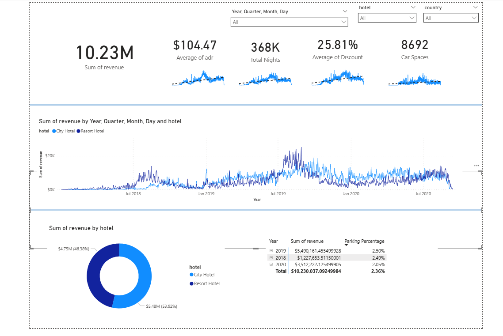

# 🏨 Hotel Revenue Analysis 

This end-to-end project analyzes hotel booking data using **SQL** for data preparation and **Power BI** for interactive visualization. It follows a structured, portfolio-ready workflow to deliver actionable business insights.

---

## 🛠 Tools Used
- **SQL** – Data wrangling, aggregation, and transformation  
- **Power BI Desktop** – Dashboard design & KPIs visualization  

---

## 📊 Project Overview


Key steps:
1. **Database Creation** – Import and organize raw hotel booking datasets (2018–2020)
2. **SQL Data Processing** –  
   - Combine yearly tables using `UNION`  
   - Calculate revenue, ADR (Average Daily Rate), and occupancy metrics  
   - Analyze parking space utilization
3. **Power BI Dashboard** – Connect to SQL database and build visuals for revenue trends, parking usage, and pricing analysis

---

## ✅ Key Insights
- **2019 was the peak year** with $5.49M in revenue — highest in the dataset.  
- **Resort Hotels slightly outperformed City Hotels** ($5.48M vs $4.75M total revenue).  
- **Parking utilization is very low** at 2.36% on average — no expansion needed.  
- **Seasonal peaks mid-year** (summer months) and dips in early months & year-end.  


---

## 📁 Project Structure
```
hotel-revenue-analysis/
├── dashboard/
│   └── hotel_revenue.pbix
├── image/
│   ├── hotel_revenue.png
├── sql_code/
│   └──project_ hotel_revenueipynb
└── README.md
```

---
